# Hi there! I'm Gangga👋

🔭 I'm currently working on developing machine learning models   
🌱 I'm currently learning deep learning frameworks and advanced ML algorithms  
🤝 I'm open to collaborating on ML research projects, data science initiatives, and AI applications  
📫 You can reach me at ganggaswara11@gmail.com   
🚀 Let's build the future with code and machine learning! 

### 🔱 Skills :

  
  
  
  
  
  
  
  

### ⛓️‍💥 Let's Connect! :

  
   

